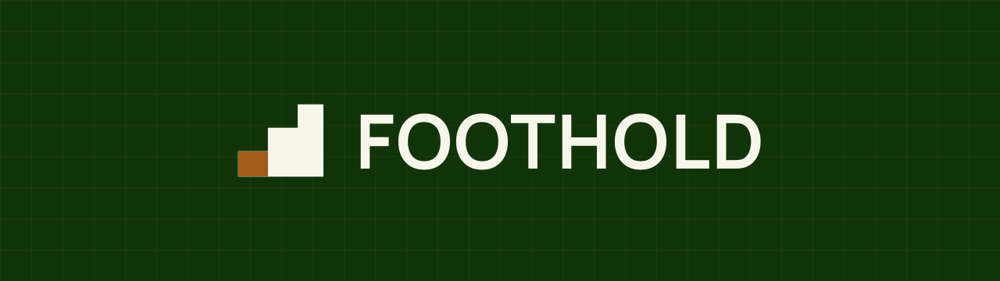

<p align="center">
  
</p>

# Foothold

A **foothold** is a secure initial position established in enemy or hostile territory. Troops use it as a base to land reinforcements, stockpile supplies, and launch further operations into the area.

For defence-sector founders, the hostile territory is the landscape itself. The MOD reorganises faster than the briefing notes can keep up. The named bodies are a thicket of acronyms (NAD Group, NA-Innov, DASA, FCI, jHub, DCTO, CSOC, IDA). The frameworks have different operators, different routes in, different gatekeepers. The information is public, but it is fragmented across hundreds of gov.uk pages, trade-body briefings, supplier directories, and Hansard transcripts. Months disappear into figuring out what the larger players already know.

Foothold gives you that secure initial position in an evening.

It is an installable Obsidian vault pack for defence-sector founders. One command lays down a working second-brain: folder structure, page templates, skills, and pre-populated open-source defence reference content. Walk into Monday with a knowledge system that already knows where the public frameworks live, which MOD body owns what, and how the pieces fit together after the post-SDR reorganisation.

The structure is built to slot into Anthropic's Cowork. A Foothold vault opened in Obsidian, with Cowork running alongside, gives a small defence-sector business something that, until recently, needed a dedicated team to put together.

The operations still have to be run. Foothold is the position you run them from.

> *"It does seem like a no brainer."*
> — an early Foothold user, by email, the day the pack was shared with them

## What changes in your first 30 days

**Day 1.** The vault is installed and knows who you are: your offer, your positioning, your voice, your priorities. Getting that in takes about an hour of guided brain dump. The defence landscape is already there: which MOD body owns what after the reorganisation, where the frameworks and portals live, which procurement route fits your stage. A question that used to cost an afternoon on gov.uk now costs a search.

**Day 15.** Your daily note is written for you each morning: what needs attention, what has rolled over, what is coming. Before an external meeting, one command briefs you from your own relationship history. When a live opportunity lands, an eligibility check tells you whether you can actually win it before you spend a week writing.

**Day 30.** Drafts are starting to sound like you, because the vault holds real samples of your writing rather than a description of your style. The CRM flags who has gone quiet. You are correcting the vault less than you did in week one, because it keeps what you teach it.

If you want to see a vault before installing anything, the [Vault Viewer](tools/vault-viewer/) reads one in your browser. No install, no account.

## What you get

- Pre-populated defence reference content, all from public sources and cited: the post-SDR MOD structure, frameworks, portals, programmes, regional clusters, a procurement playbook that says which route fits your situation, funding routes compared, and plain-English orientations on security clearance and export controls.
- Guided onboarding that builds your canonical pages from a brain dump, a first-week guide, and a Guide file in every folder explaining what goes there.
- Skills that do real work: a daily brief written for you, meeting prep from your own CRM, a pre-bid eligibility gate, a bid-response drafter built on published evaluation criteria, CRM import, process mapping, SOP capture, and a monthly curation sweep.
- One update command that pulls new content from this repo without overwriting your own work.

## Why not just ChatGPT and a folder of notes?

The AI you already use starts every conversation from zero. You carry the context to it each time, and nothing you explain today is remembered next week. Foothold keeps the context in the vault: your strategy, your customers, your engagements, your voice. Every conversation starts from there, and the vault gets more useful the longer you run it. You could build the same thing yourself from scratch; people do. What you would not have is the defence landscape already researched, or a maintained update path behind it.

## Audience

Founders running defence-sector businesses, including founders who are new to AI; the pack assumes no prior Obsidian or Claude experience. Free and available to all. Hands-on onboarding and ongoing support are available from MilUX as a paid service; email for current pricing.

## Getting started

This is the install walkthrough. The whole thing takes about ten minutes once you have Cowork and Obsidian open.

### What you'll need

- **A paid Claude subscription, with Cowork.** Cowork is Anthropic's desktop app for non-developers, and it runs inside a paid Claude plan. Sign up and subscribe at [claude.com](https://claude.com), then download the Claude desktop app; Cowork is a tab inside it. There is a running cost here: budget for one Claude subscription per person who will run the vault.
- **Obsidian.** Free knowledge management app. Download from [obsidian.md](https://obsidian.md). Obsidian Sync, used for keeping a vault in step across devices or people, is a paid add-on; a free alternative is covered under Scaling across a team below.

### What it costs, honestly

| Item | Cost | Ongoing effort |
|------|------|----------------|
| Foothold itself | Free, MIT licensed | — |
| Claude subscription (with Cowork) | Your Claude plan, per person ([claude.com](https://claude.com) has current pricing) | — |
| Obsidian | Free | — |
| Obsidian Sync (optional, for multi-device) | Paid add-on; free git alternative documented in the pack | — |
| Keeping the vault honest | — | Plan for about half an hour a week of review and correction, less as it learns |
| Hands-on onboarding from MilUX (optional) | Paid; email matt@milux.co.uk for current pricing | — |

The half-hour a week is the real cost. It is also how the vault learns your business: the corrections you make are the teaching.

### Step 1 — Run the setup

Open a new Cowork chat and paste the following:

```
Fetch https://raw.githubusercontent.com/MilUX-Ltd/foothold/main/foothold/skills/foothold-setup/SKILL.md and follow the instructions in it exactly.
```

The skill takes over from here. It will:

1. **Lay down your vault.** Create a folder structure at `~/Obsidian/Foothold/` (or a custom path if you specify one). Silent step, takes a few seconds.
2. **Run a guided brain dump.** Two short forms covering six areas: who you are, what you sell into defence, your positioning, your voice, your current priorities, and your tool stack. Type, paste links, or upload documents against any of them; the single best input is a dictation transcript, rambled and untidied. Skip anything you like. Give it the hour it deserves; everything the vault does afterwards is built from this.
3. **Offer a context drop.** One final question inviting you to paste links, upload files, or point at a local folder of source material. The more you give it, the more personalised your vault will be.
4. **Build your canonical pages.** Silently. The skill drafts your operator profile, organisation page, brand and strategy pages, email signature, and voice notes from the answers and corpus.
5. **Offer the running rhythm.** Whether to schedule `/foothold-update` (weekly or monthly), a daily brief on weekday mornings, a monthly curation sweep, and a one-week check-in. Everything is optional and can be cancelled later.

When the skill finishes, it tells you where the vault was created and which schedule (if any) is now in place.

### Step 2 — Open your vault in Obsidian

1. Launch Obsidian.
2. Click "Open folder as vault".
3. Point at your new Foothold vault folder (default: `~/Obsidian/Foothold/`).
4. Click "Open".

Your vault is live. The top-level folders appear in the sidebar.

## Keeping your pack up to date

Foothold evolves. New content gets added, existing pages get sharpened, new skills land. After your initial install, all updates happen through a skill that lives inside your vault: no marketplace refreshing, no plugin reinstalling, no Cowork restarting.

### How to trigger an update

1. Open Cowork and make sure it's pointed at your Foothold vault folder. Cowork picks up the vault's skills automatically from the vault's `Skills/` folder.
2. In a Cowork chat, type:

   ```
   /foothold-update
   ```

   Or ask in natural language: "update Foothold", "pull the latest from the Foothold repo", "see if there's anything new in Foothold". Any of those triggers the same skill.

3. The skill goes straight to the public Foothold repository on GitHub via a plain HTTPS request and compares what's there to what you have. It works out the state of every file: new on GitHub, changed upstream since you last pulled, edited locally, or in conflict (you've edited and so has upstream). You're told what's safe to apply automatically and asked what to do about anything you've personalised.
4. When it finishes, you'll see a short report of what was added, what was updated, what was merged, and what was left alone.

### Why this works without any setup

The `/foothold-update` skill lives at `Skills/foothold-update/SKILL.md` inside your vault. It was placed there by the initial `/foothold-setup` run. Cowork sees it the moment your vault is open. The skill makes a plain HTTPS request to the public Foothold GitHub URLs: no GitHub account, no auth, no Terminal, no Git on your machine.

### How conflicts are handled

The update skill is a three-way reconcile. It tracks the SHA (the GitHub blob identifier) of every file at the moment it was last pulled to your vault, stored in `.foothold/config.yml` under `last_known_shas:`. On each run, it compares three things per file: what was last pulled, what's currently on GitHub, and the SHA of the version sitting in your vault right now.

That tells it which of these situations each file is in:

- **Untouched both sides.** Skip; nothing to do.
- **Upstream-only change.** You haven't edited the file; upstream has. Safe to apply, applied by default with a chance to veto.
- **Local edit only.** You've edited; upstream hasn't changed. Skip; there's nothing new to bring in.
- **New on GitHub.** Add it.
- **Conflict.** You've edited the file AND upstream has new changes. You're asked per file: take theirs (overwrite local), keep mine (skip), or merge (the skill proposes a combined version that integrates upstream's changes into your edited file and asks you to confirm before writing).

Your personalised content is never overwritten without an explicit yes from you.

## Where your data lives

Your vault will hold bid thinking, customer relationships and commercial detail, so this deserves a straight answer. The vault is a folder of files on your own machine, and nothing in the pack sends it anywhere: every skill is plain text you can read, none of them transmits data externally, and there is no MilUX server involved. When you work with the vault through Cowork, the content you use in a session is processed by Claude under the terms of your Anthropic plan; read those terms and your plan's data settings before deciding what the vault should hold, the same diligence you would apply to any processor.

Some things should never go in, whatever your plan says: anything carrying a classification marking, anything subject to export control, and client material under handling caveats. The installed vault carries a fuller page on all of this, including how the setup sits inside a Cyber Essentials posture and what to say when a prime's supply-chain security questionnaire asks.

## Yours, forever

Worth stating plainly, because everyone has been burned by a tool that died: your vault does not depend on us. It is a folder of plain Markdown files on your own machine, MIT licensed. Updates arrive over a plain HTTPS request to this public repository; there is no MilUX server or account in the loop. If Foothold stopped being maintained tomorrow, your vault would keep working exactly as it does today, and any text editor could still read it. You could fork this repository and maintain your own line.

## What's next

In the first hour, focus on:

1. **Open `Context/<your name>.md`.** Check the operator profile reads well. Revise anything that needs sharpening.
2. **Read the per-folder Guides.** Every folder has a `<Folder Name> Guide.md` at its root. Knowledge Guide, Operations Guide, Context Guide, and CRM Guide are the load-bearing ones.
3. **Connect Cowork to your vault.** Point Cowork at your new vault folder. Cowork and Obsidian now work against the same files; agents you run in Cowork write into the vault, and you see them in Obsidian.

## Running Foothold in a small firm

Foothold is built for a single operator first, and that is still the right way in. But most defence SMEs are not one person, so here is the pattern that works for a firm of five to ten people. It is how MilUX itself runs.

**Month one: one person.** Usually the MD, or whoever owns business development, because the landscape content, the eligibility gate and the bid drafter serve that seat first. One Claude subscription. Prove the vault earns its keep before involving anyone else.

**Month two: a second seat and a named curator.** The curator decides what becomes canonical. Foothold's value rests on its content being trustworthy, and that holds only if changes go through someone. In a small firm the curator is usually the ops manager, not the MD, and the weekly half-hour of review belongs to them. Everyone else's drafts land in a staging folder; the curator promotes what deserves to be permanent.

**Who actually needs to pay.** Only people driving the vault through Cowork need a Claude subscription. Colleagues who just need to read it need neither a subscription nor Obsidian: the free [Vault Viewer](tools/vault-viewer/) reads the whole vault in a browser. A realistic pattern for a seven-person firm is two or three subscriptions and the viewer for everyone else.

**What to bring in, and what to leave where it is.** Do not migrate your SharePoint. The vault is the working layer: strategy, relationships, engagements, the landscape. Documents stay in the systems that already hold them, `/import-relationships` brings your living contacts across, and everything else earns its place one page at a time.

The mechanics once two or more people share a vault:

- **Sync.** Obsidian Sync is the paid, no-setup option. A private Git repository is free and gives you version history, at the cost of a little setup. Pick one before two people are editing, not after; the pack's Sync and Backup page compares them.
- **Write boundaries.** Everyone can read everything; drafts land in staging; only the curator writes to the canonical folders. Keep agents on a tighter rein than people.
- **Updates.** `/foothold-update` reconciles one vault against this repository. Agree that only the curator runs it, and avoid two people editing the same file in the same window.

None of this is needed on day one. Set the vault up as a single operator, get value from it, and come back to this section when the second person is ready.

## Tools

Standalone tools that ship with Foothold but install nothing live in [`tools/`](tools/).

- **[Vault Viewer](tools/vault-viewer/)** (v1.0.0). A single HTML file that reads a Foothold vault, or any folder of Markdown notes, like a website. No install, no cloud, no Obsidian. Wikilinks, search and backlinks all work, and it runs fully offline with no network requests. Use it to hand a vault to someone who does not have Obsidian, or to read your own on a machine that does not. Download `tools/vault-viewer/vault-viewer.html`, open it in Chrome, Edge or Brave, and point it at a folder. See the [tool README](tools/vault-viewer/README.md) for detail.

## Share back

Foothold gets better the more it knows about the landscape. If you come across something useful that isn't in here (a new MOD body, a framework or programme nobody else has documented well, a portal that's just launched, a sharper definition for an acronym, a piece of doctrine worth surfacing in the Reading List), send it to Matt. A line of LinkedIn, an email, or a screenshot of the page will do. He'll integrate it into the next update so everyone else on the network gets the benefit.

Email: matt@milux.co.uk. LinkedIn: [Matt Odell](https://www.linkedin.com/in/mattodell/).

## Troubleshooting

**The install skill leaves `{{placeholder}}` text in some files** — That's a bug. Tell Matt which files and which placeholder, and we'll fix it.

**Obsidian doesn't see the vault** — Make sure you point "Open folder as vault" at the Foothold root, not at a subfolder.

**Anything else** — Email Matt at matt@milux.co.uk or open an issue at https://github.com/MilUX-Ltd/foothold/issues.

## Help

- Email: matt@milux.co.uk
- GitHub issues: https://github.com/MilUX-Ltd/foothold/issues
- LinkedIn: [Matt Odell](https://www.linkedin.com/in/mattodell/)

## Provenance

Foothold is built by [Matt Odell](https://www.linkedin.com/in/mattodell/), founder of [MilUX](https://milux.co.uk), a defence-focused user-centred design consultancy, and a serving Army Reserve officer. The structure, conventions, and skills come from MilUX's own working vault: the system the company runs its business on, exported and made installable. When something in Foothold improves, it is usually because it broke or fell short in real use first. It also improves with contributions from the network; if you find something useful that isn't in here, see [Share back](#share-back).
